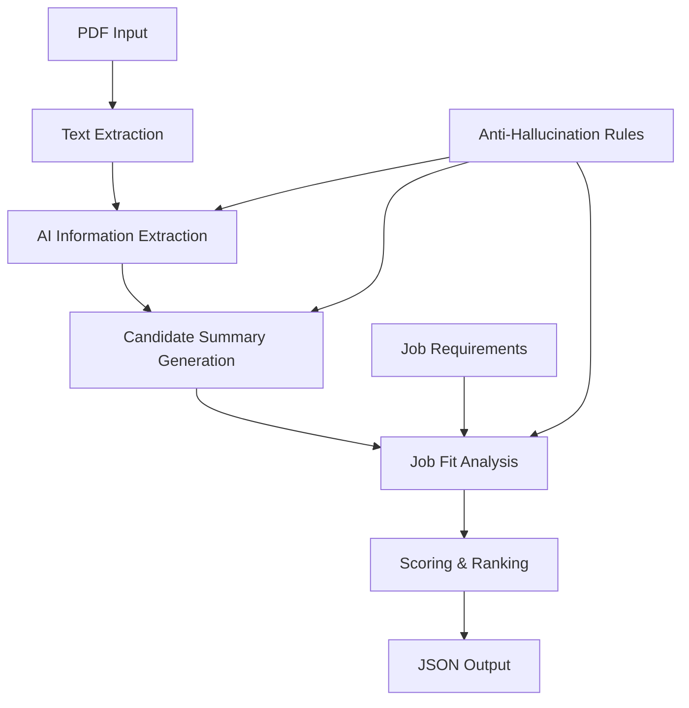

# 🎯 AI-Powered CV Analysis System

> **Advanced CV screening and candidate evaluation using Qwen2.5:1.5B-Instruct AI model**

An intelligent recruitment assistant that extracts, analyzes, and ranks CV candidates using state-of-the-art AI technology. This system provides comprehensive candidate evaluation with anti-hallucination measures to ensure accurate and reliable results.

---

## 📋 Table of Contents

- [🎯 Overview](#-overview)
- [✨ Key Features](#-key-features)
- [🏗️ System Architecture](#️-system-architecture)
- [🚀 Quick Start Guide](#-quick-start-guide)
- [📖 Detailed Usage](#-detailed-usage)
- [⚙️ Configuration](#️-configuration)
- [📊 Output Examples](#-output-examples)
- [🔧 Technical Details](#-technical-details)
- [💡 Best Practices](#-best-practices)
- [🔨 Troubleshooting](#-troubleshooting)
- [📈 Performance Metrics](#-performance-metrics)
- [🛠️ Development](#️-development)
- [📄 License](#-license)

---

## 🎯 Overview

This CV Analysis System leverages the **Qwen2.5:1.5B-Instruct** language model to provide intelligent, automated CV screening for recruitment processes. The system is designed to:

- **Extract structured information** from PDF CVs with high accuracy
- **Generate professional candidate summaries** using AI-powered natural language processing
- **Provide detailed reasoning** for job fit assessment with transparent scoring
- **Rank candidates** based on customizable job requirements
- **Prevent AI hallucination** through strict prompt engineering and validation

### 🎯 Target Use Cases

- **HR Departments**: Automate initial CV screening for large candidate pools
- **Recruitment Agencies**: Provide consistent, objective candidate evaluation
- **Hiring Managers**: Get detailed insights and reasoning for hiring decisions
- **Small Businesses**: Access enterprise-level CV analysis without complex setup

---

## ✨ Key Features

### 🤖 **AI-Powered Analysis**
- **Qwen2.5:1.5B-Instruct Model**: State-of-the-art language model for intelligent text understanding
- **Contextual Understanding**: Goes beyond keyword matching to understand candidate qualifications
- **Natural Language Reasoning**: Provides human-readable explanations for fit assessment

### 📄 **Document Processing**
- **PDF Text Extraction**: Robust extraction from various PDF formats
- **Multi-language Support**: Handles CVs in different languages (model dependent)
- **Error Handling**: Graceful handling of corrupted or unreadable files

### 🎯 **Job Matching System**
- **Customizable Job Templates**: Pre-built templates for common roles
- **Interactive Job Creation**: Step-by-step job requirement setup
- **Flexible Scoring**: Weighted scoring based on skills, experience, and education

### 🛡️ **Anti-Hallucination Technology**
- **Strict Prompt Engineering**: Prevents AI from adding false information
- **Fact-Based Analysis**: Only considers explicitly mentioned qualifications
- **Conservative Scoring**: Ensures reliable and trustworthy results

### 📊 **Comprehensive Reporting**
- **Detailed Candidate Summaries**: Professional summaries highlighting key strengths
- **Fit Score Analysis**: Numerical scoring with detailed reasoning
- **Batch Processing**: Analyze multiple CVs simultaneously with ranking
- **JSON Export**: Machine-readable results for integration with other systems

---

## 🏗️ System Architecture

```
📁 chatbot-sso/
├── 📄 main.py                          # Main application entry point
├── 📄 requirements.txt                 # Python dependencies
├── 📁 analyzer/                        # Core analysis modules
│   ├── 📄 cv_analyzer.py              # Alternative CLI interface
│   └── 📁 processors/                 # Processing engines
│       └── 📄 simple_cv_analyzer.py   # Qwen2.5 CV analysis engine
├── 📁 cv/                             # Sample CV storage
├── 📁 cv_test_1/                      # Test CV files
├── 📄 cv_analysis_*.json              # Generated analysis results
└── 📁 venv/                          # Python virtual environment
```

### 🔄 Processing Pipeline



---

## 🚀 Quick Start Guide

### 📋 Prerequisites

- **Python 3.8+** (Recommended: Python 3.9 or 3.10)
- **4GB+ RAM** (8GB+ recommended for optimal performance)
- **3GB disk space** for AI model download
- **Internet connection** for initial model download

### ⚡ Installation

1. **Clone or download the project**
```bash
git clone <repository-url>
cd cv-analysis-system
```

2. **Create virtual environment** (Recommended)
```bash
python -m venv venv

# Windows
venv\Scripts\activate

# macOS/Linux
source venv/bin/activate
```

3. **Install dependencies**
```bash
pip install -r requirements.txt
```

4. **Verify installation**
```bash
python main.py
```

### 🎬 First Run

1. **Run the application**
```bash
python main.py
```

2. **Follow the interactive setup**:
   - Choose a job template or create custom requirements
   - Select CV files to analyze
   - Review results

3. **Check generated files**:
   - Look for `cv_analysis_*.json` files in the project directory

---

## 📖 Detailed Usage

### 🎯 **Interactive Mode (Recommended)**

The main application provides a guided experience:

```bash
python main.py
```

**Step-by-Step Process:**

1. **Job Description Setup**
   - Choose from predefined templates (Data Analyst, Software Engineer, Project Manager)
   - Create custom job requirements interactively
   - Load job description from JSON file

2. **CV Source Selection**
   - Analyze single CV file
   - Process entire folder of CVs
   - Use default CV folder (`../cv`)

3. **AI Model Initialization**
   - Automatic download and loading of Qwen2.5 model
   - System optimization based on available resources

4. **Analysis Execution**
   - Real-time progress updates
   - Error handling and reporting
   - Automatic result saving

### 🖥️ **Command Line Mode**

For automation and scripting:

```bash
# Direct analyzer usage
cd analyzer
python cv_analyzer.py --file ../cv/resume.pdf --detailed
python cv_analyzer.py --folder ../cv --output results.json
```

### 📝 **Job Template Examples**

#### Data Analyst Template
```python
{
    'title': 'Senior Data Analyst',
    'department': 'Analytics & Business Intelligence',
    'requirements': {
        'education': 'Bachelor degree in Statistics, Mathematics, Computer Science, or related field',
        'skills': ['Python', 'SQL', 'Data Analysis', 'Excel', 'Tableau', 'Power BI', 'Statistics'],
        'experience_years': 3,
        'domain_knowledge': ['Business Intelligence', 'Data Visualization', 'Statistical Analysis'],
        'soft_skills': ['Communication', 'Problem Solving', 'Team Collaboration'],
        'preferred': ['Machine Learning', 'R', 'Advanced Excel', 'Database Management']
    }
}
```

#### Software Engineer Template
```python
{
    'title': 'Software Engineer',
    'department': 'Engineering',
    'requirements': {
        'education': 'Bachelor degree in Computer Science, Software Engineering, or related field',
        'skills': ['Python', 'JavaScript', 'SQL', 'Git', 'REST APIs', 'Database Design'],
        'experience_years': 2,
        'domain_knowledge': ['Web Development', 'Software Architecture', 'Database Management'],
        'soft_skills': ['Problem Solving', 'Team Collaboration', 'Communication'],
        'preferred': ['React', 'Node.js', 'Docker', 'AWS', 'CI/CD']
    }
}
```

---

## ⚙️ Configuration

### 🎛️ **Job Requirements Configuration**

You can modify job requirements in several ways:

1. **Interactive Creation** (main.py)
2. **Direct Code Modification** (analyzer/processors/simple_cv_analyzer.py)
3. **JSON File Loading**

#### Custom Job JSON Format
```json
{
  "title": "Your Job Title",
  "department": "Department Name",
  "requirements": {
    "education": "Education requirements",
    "skills": ["Skill1", "Skill2", "Skill3"],
    "experience_years": 3,
    "domain_knowledge": ["Domain1", "Domain2"],
    "soft_skills": ["Communication", "Leadership"],
    "preferred": ["Nice-to-have1", "Nice-to-have2"]
  }
}
```

### 🔧 **AI Model Configuration**

The system uses Qwen2.5:1.5B-Instruct with optimized parameters:

```python
# Generation parameters (in simple_cv_analyzer.py)
temperature=0.3,        # Conservative for accuracy
top_p=0.6,             # Focused sampling
repetition_penalty=1.1  # Reduce repetition
```

### 💾 **Memory Optimization**

For systems with limited memory:

1. **Reduce batch size** in code
2. **Use CPU instead of GPU** if memory issues occur
3. **Close other applications** during processing

---

## 📊 Output Examples

### 📱 **Console Output**

```
🎯 CV ANALYZER - AI-Powered Recruitment Assistant
==================================================

📋 JOB DESCRIPTION SETUP
------------------------
Selected: Senior Data Analyst

🤖 Initializing AI CV Analyzer...
✅ CV Analyzer initialized successfully!

📁 CV SELECTION
---------------
✅ Found 5 PDF files in default folder

🚀 Starting CV Analysis...
--------------------------

🏆 TOP CANDIDATES (by fit score):
 1. john_smith_cv.pdf                   87% (Yes)
 2. sarah_jones_resume.pdf              73% (Yes)
 3. mike_wilson_cv.pdf                  65% (Yes)
 4. lisa_brown_resume.pdf               52% (Maybe)
 5. tom_davis_cv.pdf                    38% (No)

💾 Results saved to: cv_analysis_batch_20250829_130423.json
```

### 📄 **JSON Output Structure**

```json
{
  "analysis_timestamp": "2025-08-29T13:04:23.456789",
  "total_analyzed": 5,
  "successful": 5,
  "results": [
    {
      "filename": "john_smith_cv.pdf",
      "file_path": "/path/to/cv/john_smith_cv.pdf",
      "status": "success",
      "extracted_info": "**Full Name:** John Smith\n**Contact:** john.smith@email.com, +1234567890\n**Education:** Bachelor of Computer Science, MIT (2018)\n**Technical Skills:** Python, SQL, Tableau, Power BI, Statistics, Machine Learning\n**Experience:** 5 years in data analysis roles\n**Summary:** Experienced data analyst with strong technical background",
      "candidate_summary": "John Smith is an experienced data analyst with 5 years of professional experience and a strong educational background from MIT. His technical expertise includes Python, SQL, Tableau, Power BI, and advanced statistical analysis, making him well-suited for data-driven roles.",
      "job_fit_analysis": {
        "reasoning": "**STRENGTHS:**\n- Strong technical skills match: Python, SQL, Tableau, Power BI all directly mentioned\n- Relevant educational background: Computer Science degree\n- Appropriate experience level: 5 years exceeds minimum requirement of 3 years\n- Advanced skills: Machine Learning mentioned as preferred skill\n\n**GAPS/WEAKNESSES:**\n- No explicit mention of Excel proficiency\n- Statistics knowledge could be more detailed\n\n**OVERALL RECOMMENDATION:** Yes\n- Excellent technical skill alignment (90% match)\n- Education and experience requirements met\n- Strong foundation for senior data analyst role\n- Fit percentage: 87%",
        "fit_score": 0.87,
        "recommendation": "Yes"
      },
      "analysis_timestamp": "2025-08-29T13:04:23.456789",
      "processing_time_seconds": 3.2
    }
  ]
}
```

### 📈 **Detailed Analysis Report**

```
====================================================
📄 ANALYSIS RESULT: john_smith_cv.pdf
====================================================

🎯 JOB FIT SUMMARY:
   Recommendation: Yes
   Fit Score: 87%
   Processing Time: 3.20s

📝 CANDIDATE SUMMARY:
   John Smith is an experienced data analyst with 5 years of professional 
   experience and a strong educational background from MIT. His technical 
   expertise includes Python, SQL, Tableau, Power BI, and advanced 
   statistical analysis, making him well-suited for data-driven roles.

🤔 AI REASONING:
   STRENGTHS:
   - Strong technical skills match: Python, SQL, Tableau, Power BI all directly mentioned
   - Relevant educational background: Computer Science degree
   - Appropriate experience level: 5 years exceeds minimum requirement of 3 years
   - Advanced skills: Machine Learning mentioned as preferred skill

   GAPS/WEAKNESSES:
   - No explicit mention of Excel proficiency
   - Statistics knowledge could be more detailed

   OVERALL RECOMMENDATION: Yes
   - Excellent technical skill alignment (90% match)
   - Education and experience requirements met
   - Strong foundation for senior data analyst role
   - Fit percentage: 87%
```

---

## 🔧 Technical Details

### 🤖 **AI Model Specifications**

- **Model**: Qwen/Qwen2.5-1.5B-Instruct
- **Size**: ~3GB download
- **Type**: Instruction-tuned large language model
- **Optimization**: FP16 precision for GPU, FP32 for CPU
- **Context Length**: 8192 tokens

### 🏗️ **Core Components**

#### SimpleCVAnalyzer Class
```python
class SimpleCVAnalyzer:
    def __init__(self):
        # Initialize Qwen2.5 model and tokenizer
        
    def extract_text_from_pdf(self, pdf_path: str) -> str:
        # PDF text extraction using PyPDF2
        
    def extract_cv_information(self, cv_text: str) -> Dict:
        # AI-powered structured information extraction
        
    def generate_candidate_summary(self, cv_info: str) -> str:
        # Professional summary generation
        
    def reason_job_fit(self, cv_info: str, candidate_summary: str) -> Dict:
        # Job fit analysis with detailed reasoning
        
    def analyze_cv(self, pdf_path: str) -> Dict:
        # Complete analysis pipeline
        
    def analyze_multiple_cvs(self, cv_folder: str) -> List[Dict]:
        # Batch processing with ranking
```

### 🛡️ **Anti-Hallucination Measures**

1. **Strict Prompt Engineering**
```python
prompt = """
IMPORTANT: Only extract information that is EXPLICITLY mentioned in the CV text.
Do NOT add, assume, or infer any information that is not clearly stated.

CRITICAL RULES:
- If information is not in the CV, write "Not mentioned" or "Not provided"
- Do not assume or add skills that are not explicitly listed
- Stick strictly to what is written in the document
"""
```

2. **Conservative Generation Parameters**
```python
temperature=0.3,          # Lower creativity, higher accuracy
top_p=0.6,               # More focused token selection
repetition_penalty=1.1    # Reduce repetitive responses
```

3. **Fact-Based System Prompts**
```python
system_prompt = """
You are a professional HR assistant that analyzes CVs with strict accuracy. 
You MUST only extract and use information that is explicitly stated in the 
provided documents. Never assume, infer, or add information that is not 
clearly written.
"""
```

### ⚡ **Performance Optimizations**

- **GPU Detection**: Automatic CUDA utilization when available
- **Memory Management**: Efficient tensor handling and cleanup
- **Batch Processing**: Optimized for multiple CV analysis
- **Error Recovery**: Graceful handling of processing failures

---

## 💡 Best Practices

### 📄 **CV Preparation**

1. **PDF Quality**: Use text-based PDFs (not scanned images)
2. **File Naming**: Use descriptive filenames (e.g., "john_smith_cv.pdf")
3. **Content Structure**: Well-organized CVs produce better results
4. **Language**: English CVs work best with current model

### 🎯 **Job Requirements Setup**

1. **Be Specific**: Detailed requirements lead to better matching
2. **Use Standard Terms**: Common industry terminology works best
3. **Balance Requirements**: Include must-haves and nice-to-haves
4. **Update Regularly**: Keep job templates current with market needs

### 🔍 **Analysis Interpretation**

1. **Fit Scores**:
   - **80-100%**: Excellent match, strong candidate
   - **65-79%**: Good match, worth interviewing
   - **40-64%**: Possible match, review carefully
   - **Below 40%**: Poor match, likely not suitable

2. **Review AI Reasoning**: Always read the detailed reasoning for context
3. **Consider Soft Skills**: Technical fit is important, but not everything
4. **Use as Initial Screening**: Supplement with human review for final decisions

### 🔧 **System Optimization**

1. **Hardware Recommendations**:
   - **Minimum**: 4GB RAM, Intel i5 or equivalent
   - **Recommended**: 8GB+ RAM, GPU with 4GB+ VRAM
   - **Optimal**: 16GB+ RAM, RTX 3060 or better

2. **Batch Size Guidelines**:
   - **Small batches**: 1-5 CVs for testing
   - **Medium batches**: 10-20 CVs for regular use
   - **Large batches**: 50+ CVs for bulk processing

---

## 🔨 Troubleshooting

### ❌ **Common Issues**

#### 1. **Model Download Failures**
```
Error: Failed to download model
```
**Solutions:**
- Check internet connection
- Ensure sufficient disk space (3GB+)
- Try running again (downloads resume automatically)
- Use VPN if in restricted region

#### 2. **Memory Errors**
```
RuntimeError: CUDA out of memory
```
**Solutions:**
- Close other applications
- Use CPU instead of GPU: Set `device="cpu"`
- Reduce batch size in code
- Restart Python session

#### 3. **PDF Reading Errors**
```
Error reading PDF: PdfReadError
```
**Solutions:**
- Ensure PDF is not password-protected
- Try converting to different PDF format
- Check file permissions
- Use text-based PDFs (not scanned images)

#### 4. **Import Errors**
```
ImportError: No module named 'transformers'
```
**Solutions:**
- Activate virtual environment
- Install requirements: `pip install -r requirements.txt`
- Check Python version (3.8+ required)
- Reinstall dependencies if needed

### 🔧 **Performance Issues**

#### Slow Processing
1. **Check system resources** (Task Manager/Activity Monitor)
2. **Use GPU if available** (automatic detection)
3. **Process smaller batches**
4. **Upgrade hardware** if regularly processing large volumes

#### Inconsistent Results
1. **Check CV quality** (text-based vs. scanned)
2. **Verify job requirements** are specific and clear
3. **Update model** if using cached version
4. **Review AI reasoning** for patterns

### 📞 **Getting Help**

1. **Check logs** for detailed error messages
2. **Review requirements.txt** for dependency versions
3. **Test with sample CVs** to isolate issues
4. **Update dependencies** if problems persist

---

## 🛠️ Development

### 🔧 **Code Structure**

#### Main Application (`main.py`)
- Interactive job setup
- CV source selection
- Analysis execution
- Result presentation

#### Core Analyzer (`analyzer/processors/simple_cv_analyzer.py`)
- AI model initialization
- PDF text extraction
- Information extraction pipeline
- Job fit analysis

#### Alternative Interface (`analyzer/cv_analyzer.py`)
- Command-line interface
- Batch processing utilities
- Result formatting

### 🧪 **Testing**

```bash
# Test with sample CVs
python main.py
# Select option 3 (default folder)
# Use test CVs in cv/ folder

# Command line testing
cd analyzer
python cv_analyzer.py --file ../cv_test_1/test.pdf --detailed
```

### 🔄 **Adding New Features**

1. **New Job Templates**: Add to `job_templates` dictionary in `main.py`
2. **Custom Scoring**: Modify `reason_job_fit` method
3. **Output Formats**: Extend result saving functions
4. **Model Updates**: Change `model_name` in `SimpleCVAnalyzer`

### 📦 **Dependencies Management**

```bash
# Update requirements
pip freeze > requirements.txt

# Install development dependencies
pip install jupyter notebook matplotlib seaborn

# Create minimal requirements
pip install torch transformers PyPDF2 pathlib2
```

---

## 🚀 Future Enhancements

### 🔮 **Planned Features**

1. **Multi-language Support**: Support for non-English CVs
2. **Resume Parsing APIs**: RESTful API for system integration
3. **Web Interface**: Browser-based CV upload and analysis
4. **Database Integration**: Store and track candidate analyses
5. **Advanced Filtering**: Complex query-based candidate filtering
6. **Custom Model Training**: Fine-tune models for specific industries

### 🎯 **Optimization Roadmap**

1. **Model Quantization**: Reduce memory usage further
2. **Async Processing**: Concurrent CV analysis
3. **Caching System**: Store processed results for quick retrieval
4. **Auto-scaling**: Dynamic resource allocation based on workload

---

## 📄 License

This project is developed for educational and research purposes. 

### 📚 **Third-Party Components**

- **Qwen2.5**: Apache 2.0 License
- **Transformers**: Apache 2.0 License  
- **PyPDF2**: BSD License
- **Other dependencies**: Various open-source licenses

### ⚖️ **Usage Terms**

- ✅ Educational use
- ✅ Research purposes
- ✅ Internal business use
- ❌ Commercial redistribution without permission
- ❌ Using for discriminatory hiring practices

---

## 🙏 Acknowledgments

### 🏆 **Technologies Used**

- **[Qwen2.5](https://huggingface.co/Qwen)** - Advanced language model by Alibaba
- **[Hugging Face Transformers](https://huggingface.co/transformers/)** - Model hosting and inference
- **[PyPDF2](https://pypi.org/project/PyPDF2/)** - PDF text extraction
- **[PyTorch](https://pytorch.org/)** - Deep learning framework

### 👥 **Contributors**

- Development Team - Core system implementation
- AI Research Community - Model development and optimization
- Open Source Community - Supporting libraries and tools

---

## 📞 Support & Contact

**📊 Version**: 1.0.0  
**📅 Last Updated**: August 29, 2025  
**🔧 Compatibility**: Python 3.8+ | Windows/macOS/Linux  
**💾 Model Size**: 3GB | **⚡ Min RAM**: 4GB | **🚀 Recommended RAM**: 8GB+

---

*Happy CV analyzing! 🎯✨*
